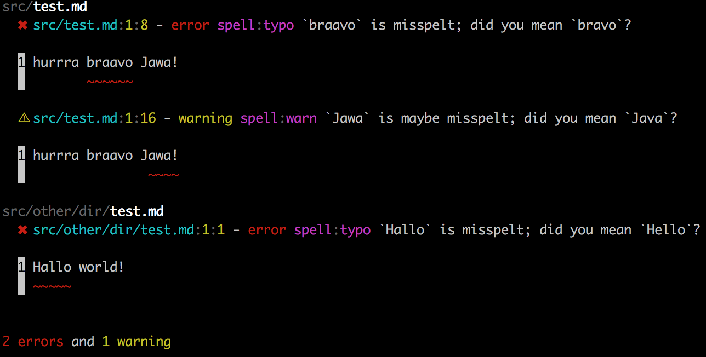

# vfile-reporter-position

Format [**vfile**](https://github.com/vfile/vfile)s using a stylish reporter with position output and a summary line.

If the `VFile` has contents and a message will have a position then it will print the first erroneous line.



This project was bootstrapped with [TSDX](https://github.com/jaredpalmer/tsdx).

## Install

```sh
npm install vfile-reporter-position
```

## Usage

See `test/index.test.ts` for the example from the screenshot.

## API

### `reporter(files: VFile[]): string`

Return a stylish report for the given `VFile` array.

Files without messages are ignored.

If there are no messages at all, it will return an empty string.

## Inspired by

* [vfile-reporter](https://github.com/vfile/vfile-reporter): It offers more options but prints the position only as numbers.

## TODO

* Write tests
* Add options

## License

[MIT](LICENSE) © Bernhard Berger
